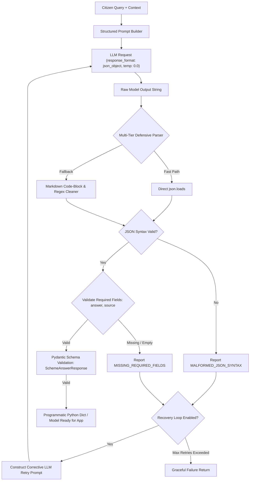

# SchemeAssist RAG Assistant — Development Environment & Workspace Setup

Welcome to the **SchemeAssist RAG Assistant** workspace repository. This repository establishes a clean, isolated, reproducible development workspace foundation following standard AI application engineering practices.

---

## 📁 Repository Structure

```
AK-47_Scheme_Assist_Squad81/
├── data/              # Source knowledge documents (git-ignored except sample/placeholders)
│   ├── .gitkeep
│   └── sample_doc.md
├── src/               # Application source code (ingestion, retrieval, config, main app)
│   ├── __init__.py
│   ├── config.py
│   ├── ingestion.py
│   ├── retrieval.py
│   └── main.py
├── prompts/           # Decoupled system prompts and templates
│   ├── .gitkeep
│   ├── README.md
│   └── rag_system_prompt.txt
├── outputs/           # Application logs, generated answers, evaluation outputs
│   └── .gitkeep
├── .env               # Local environment variables & secrets (GIT-IGNORED)
├── .env.example       # Template of required environment variables (COMMITTED)
├── .gitignore         # Strict exclusion rules for secrets, .venv, and data
├── requirements.txt   # Locked python dependencies for reproducible setup
└── README.md          # Setup instructions and verification documentation
```

---

## 🚀 Setup & Installation Instructions

Follow these exact steps to reproduce the environment and run the application on any fresh machine:

### Step 1: Clone the Repository
```bash
git clone https://github.com/kalviumcommunity/AK-47_Scheme_Assist_Squad81.git
cd AK-47_Scheme_Assist_Squad81
```

### Step 2: Create & Activate Virtual Environment
- **Windows (PowerShell):**
  ```powershell
  python -m venv .venv
  .\.venv\Scripts\activate
  ```
- **macOS / Linux:**
  ```bash
  python3 -m venv .venv
  source .venv/bin/activate
  ```

### Step 3: Install Project Dependencies
```bash
pip install -r requirements.txt
```

### Step 4: Configure Environment Variables
Copy `.env.example` to create your local `.env` file and populate your credentials:
- **Windows:**
  ```powershell
  copy .env.example .env
  ```
- **macOS / Linux:**
  ```bash
  cp .env.example .env
  ```

*Edit `.env` and insert your OpenAI API Key:*
```env
OPENAI_BASE_URL=https://api.openai.com/v1
OPENAI_API_KEY=your_actual_openai_api_key_here
CHAT_MODEL=gpt-4o-mini
EMBED_MODEL=text-embedding-3-small
```

---

## 🧪 Reproducibility Verification Test

To verify that your workspace setup is completely functional, run the verification entrypoint:

```bash
python src/main.py
```

### Expected Output Log Confirmation
```text
=================================================================
  [RAG App] SchemeAssist - Workspace Verification Test
=================================================================
[CONFIG LOG] Loaded model: gpt-4o-mini | Base URL: https://api.openai.com/v1
[INGESTION LOG] Successfully ingested 1 document(s) from 'data/'.
[PROMPT LOG] Loaded system prompt (246 chars).

[QUERY]: 'welfare schemes eligibility guidance'
[RETRIEVED DOC]: sample_doc.md
[CONTENT PREVIEW]:
# Knowledge Base Document: Government Welfare Schemes Overview...

[OUTPUT LOG] Verification run logged to 'outputs/verification_run.log'.
=================================================================
  [SUCCESS] WORKSPACE REPRODUCIBILITY TEST PASSED SUCCESSFULLY!
=================================================================
```

---

## 🛠️ Implemented Core Concepts

To support robust RAG operation, we have added three core utilities evaluating token usage, context history, and execution control:

### 1. Token Estimation & Billing
- **Script**: `src/token_counter.py`
- **Output Report**: `outputs/token_estimation_results.txt`
- **Purpose**: Counts token usage locally using `tiktoken` (`gpt-4o-mini` / `o200k_base` model mapping) and profiles input/output costs at target rates ($0.15/1M input, $0.60/1M output).
- **Execution**:
  ```bash
  python src/token_counter.py
  ```

### 2. Context Window & History Manager
- **Script**: `src/history_manager.py`
- **Output Report**: `outputs/history_management_results.txt`
- **Purpose**: Enforces conversational token limits using two budget-preservation strategy handlers:
  - **Trimming**: Evicts older user-assistant conversation turn pairs while preserving the target system prompt.
  - **Summarization**: Compresses older middle turns into a concise single system summary block.
- **Execution**:
  ```bash
  python src/history_manager.py
  ```

### 3. Model Parameters & Output Control
- **Script**: `src/model_parameter_experiment.py`
- **Output Report**: `outputs/parameter_experiments_results.txt`
- **Purpose**: Demonstrates execution behavior when tuning generation controls (Temperature, `max_tokens` length truncation, and `stop` sequence halting filters), recommending deterministic settings needed for grounded, factual schemes matching.
- **Execution**:
  ```bash
  python src/model_parameter_experiment.py
  ```

---

## 🔒 Security & Secret Management

- **API Keys are strictly excluded from source code:** All secrets are loaded dynamically at runtime via `python-dotenv` from the `.env` file.
- **Git Protection:** `.gitignore` explicitly prevents `.env`, `.venv/`, and sensitive files in `data/` or `outputs/` from ever being pushed to remote repositories.

---

## 🛠️ Prompt Construction & System/User Roles (3.13)

This project features a prompt construction and evaluation engine in `src/prompt_builder.py` that separates system and user roles and compares prompt variations.

### Key Capabilities:
1. **Separation of Roles**: System prompt defines operational boundaries, persona, length, tone, and refusal rules; user prompt carries the specific turn query.
2. **System Message Architecture**: Enforces Role, Scope, Constraints (2-3 sentences), and standard Fallback string.
3. **Prompt Comparison Suite**: Compares Vague vs. Constrained vs. JSON Format variations side-by-side.

### Run Prompt Construction & Comparison Suite:
```bash
python src/prompt_builder.py
```

Outputs are automatically saved to `outputs/prompt_comparison_results.txt` and documented in `prompts/PROMPT_ANALYSIS.md`.

---

## 📦 Structured Output & JSON Response Handling (3.17)

Production RAG assistants cannot rely on free-form conversational prose because downstream software systems, databases, and UI components require deterministic, structured data shapes (e.g. separating the exact answer text from cited sources and eligibility criteria).

SchemeAssist implements a **multi-tier defensive parser**, **Pydantic schema validation**, and an **automated self-healing recovery loop** in [`src/structured_output_handler.py`](file:///c:/Users/msham/Desktop/AK-47_Scheme_Assist_Squad81/src/structured_output_handler.py).

### 🏗️ Architecture & Pipeline Overview



### 📋 JSON Schema Contract

Defined in [`prompts/json_structured_prompt.txt`](file:///c:/Users/msham/Desktop/AK-47_Scheme_Assist_Squad81/prompts/json_structured_prompt.txt):

```json
{
  "answer": "string (Concise 2-3 sentence factual answer)",
  "source": "string (Official scheme circular, portal, or guideline citation)",
  "confidence": "string (High | Medium | Low)",
  "key_eligibility": ["string", "string"]
}
```

### 🛡️ Defensive Multi-Tier Parsing Strategy

| Layer | Strategy | Description |
| :--- | :--- | :--- |
| **Tier 1: Direct Parse** | `json.loads(raw)` | Ultra-fast native parsing when model returns clean JSON. |
| **Tier 2: Heuristic Cleaner** | Regex ```` ```(?:json)?\s*(\{.*?\})\s*``` ```` | Extracts JSON blocks wrapped in markdown fences or conversational preambles/closings. |
| **Tier 3: Boundary Extractor** | Regex `(\{.*\})` | Isolates JSON object boundaries if surrounded by conversational filler. |
| **Tier 4: Graceful Error Handling** | Structured `ParseResult` | Never raises unhandled exceptions. Classifies failures into `MALFORMED_JSON_SYNTAX`, `MISSING_REQUIRED_FIELDS`, or `EMPTY_REQUIRED_FIELDS`. |
| **Tier 5: Automated Recovery** | Targeted Self-Healing Retry | Sends previous raw response + explicit error message back to model requesting single corrected JSON object. |

---

### 🧪 Run Structured Output Suite & Evaluation

To execute all 5 test scenarios (Standard Clean JSON, Conversational Markdown Extraction, Syntax Error Detection, Field Validation Rejection, and Self-Healing Recovery):

```bash
python src/structured_output_handler.py
```

### 📊 Test Scenarios & Results Matrix

| Scenario ID | Scenario Name | Tasks Covered | Parse Status | Result Details |
| :---: | :--- | :--- | :---: | :--- |
| **1** | **Standard Clean JSON** | Tasks 1, 2, 4 | `True` (Valid) | Clean prompt generation with `json_object` mode parsed directly to dict and Pydantic object. |
| **2** | **Conversational Prose Wrapper** | Tasks 2, 3 | `True` (Cleaned) | Successfully extracted JSON from markdown code block surrounded by conversational greeting and closing. |
| **3** | **Malformed Syntax Detection** | Task 3 | `False` (Handled) | Trailing commas and missing quotes detected safely as `MALFORMED_JSON_SYNTAX` without application crash. |
| **4** | **Missing Fields Validation** | Task 4 | `False` (Handled) | Missing mandatory `source` field detected and rejected as `MISSING_REQUIRED_FIELDS`. |
| **5** | **Self-Healing Recovery Workflow** | Task 5 | `True` (Recovered) | Initial malformed response automatically triggered corrective retry prompt, resulting in valid parsed JSON. |

Execution artifacts are persisted to:
- **Machine-Readable JSON**: [`outputs/structured_output_results.json`](file:///c:/Users/msham/Desktop/AK-47_Scheme_Assist_Squad81/outputs/structured_output_results.json)
- **Formatted Text Report**: [`outputs/structured_output_results.txt`](file:///c:/Users/msham/Desktop/AK-47_Scheme_Assist_Squad81/outputs/structured_output_results.txt)

---

### 🎥 Video Walkthrough Script (3–5 Minutes)

When recording your screen-share submission, follow this structured walkthrough:

1. **Why Structured Output is Needed for App Integration (0:00 - 1:00)**:
   - Explain that a demo printing plain text is easy, but a production RAG application requires machine-readable data. Downstream code cannot reliably use regex to separate answers from citations or filter by eligibility criteria if the model answers in free prose.
2. **Instructing the Model for Valid JSON (1:00 - 1:45)**:
   - Walk through [`prompts/json_structured_prompt.txt`](file:///c:/Users/msham/Desktop/AK-47_Scheme_Assist_Squad81/prompts/json_structured_prompt.txt). Show the explicit JSON schema definition, the `response_format={"type": "json_object"}` setting, and `temperature=0.0` for deterministic generation.
3. **Defensive Parsing & Validation (1:45 - 2:45)**:
   - Show `StructuredOutputEngine.parse_and_validate()` in [`src/structured_output_handler.py`](file:///c:/Users/msham/Desktop/AK-47_Scheme_Assist_Squad81/src/structured_output_handler.py). Highlight direct parsing, markdown block extraction, required field verification (`answer`, `source`), and Pydantic model validation (`SchemeAnswerResponse`).
4. **What Can Go Wrong & Handling Malfunctions (2:45 - 3:45)**:
   - Explain failure modes: syntax errors (missing quotes, trailing commas), markdown fencing wrappers, and dropped required keys. Show how Scenarios 2, 3, and 4 handle these without crashing.
5. **Follow-Up: How to Recover from Malformed Output? (3:45 - 4:45)**:
   - Demonstrate Scenario 5: Self-healing retry loop. Show how the engine feeds the malformed string and specific error message back to the LLM in a corrective turn to obtain a 100% valid parsed output on retry.


