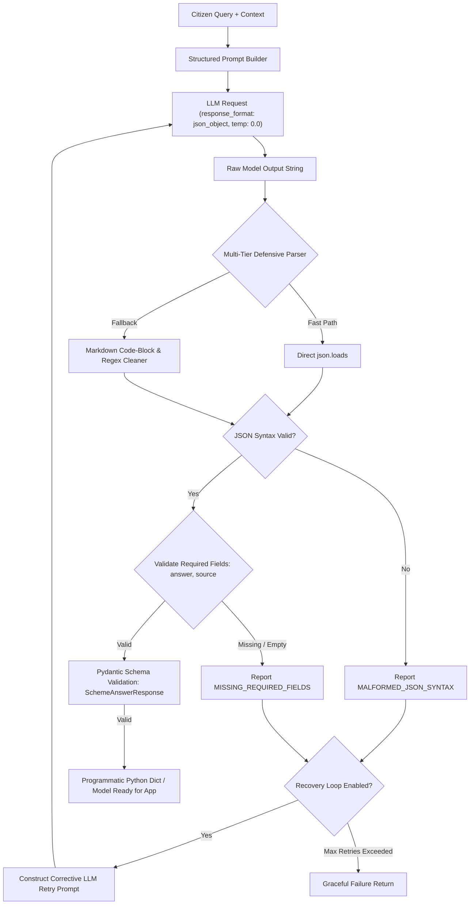
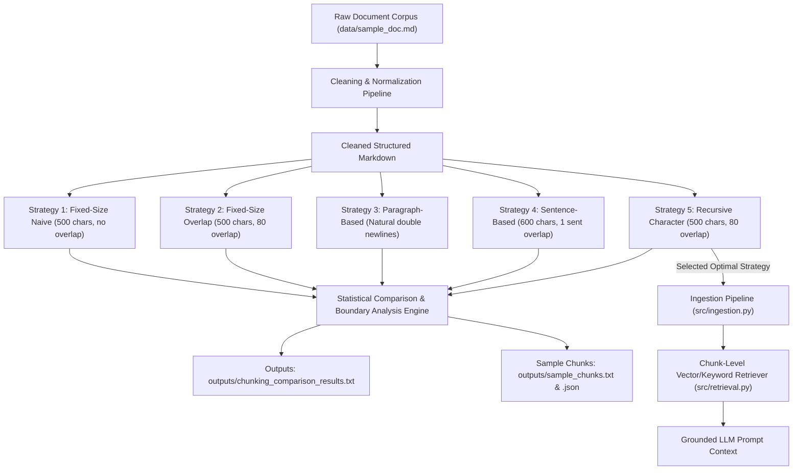
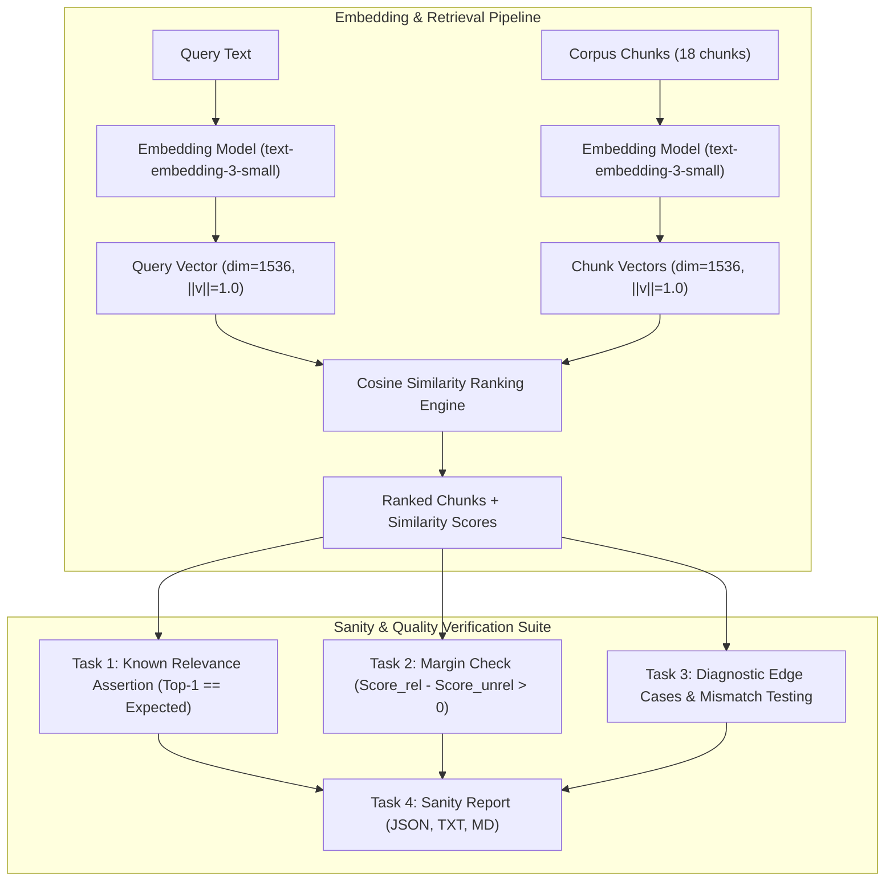
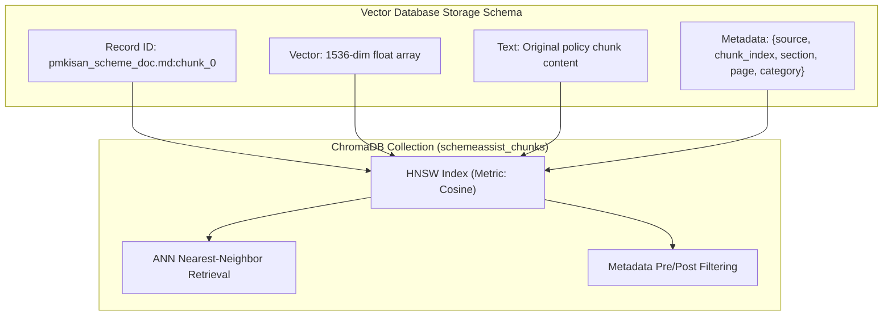

# SchemeAssist RAG Assistant — Development Environment & Workspace Setup

Welcome to the **SchemeAssist RAG Assistant** workspace repository. This repository establishes a clean, isolated, reproducible development workspace foundation following standard AI application engineering practices.

---

## 📁 Repository Structure

```
AK-47_Scheme_Assist_Squad81/
├── data/              # Source knowledge documents (git-ignored except sample/placeholders)
│   ├── .gitkeep
│   └── sample_doc.md
├── src/               # Application source code (ingestion, retrieval, config, main app)
│   ├── __init__.py
│   ├── config.py
│   ├── ingestion.py
│   ├── retrieval.py
│   └── main.py
├── prompts/           # Decoupled system prompts and templates
│   ├── .gitkeep
│   ├── README.md
│   └── rag_system_prompt.txt
├── outputs/           # Application logs, generated answers, evaluation outputs
│   └── .gitkeep
├── .env               # Local environment variables & secrets (GIT-IGNORED)
├── .env.example       # Template of required environment variables (COMMITTED)
├── .gitignore         # Strict exclusion rules for secrets, .venv, and data
├── requirements.txt   # Locked python dependencies for reproducible setup
└── README.md          # Setup instructions and verification documentation
```

---

## 🚀 Setup & Installation Instructions

Follow these exact steps to reproduce the environment and run the application on any fresh machine:

### Step 1: Clone the Repository
```bash
git clone https://github.com/kalviumcommunity/AK-47_Scheme_Assist_Squad81.git
cd AK-47_Scheme_Assist_Squad81
```

### Step 2: Create & Activate Virtual Environment
- **Windows (PowerShell):**
  ```powershell
  python -m venv .venv
  .\.venv\Scripts\activate
  ```
- **macOS / Linux:**
  ```bash
  python3 -m venv .venv
  source .venv/bin/activate
  ```

### Step 3: Install Project Dependencies
```bash
pip install -r requirements.txt
```

### Step 4: Configure Environment Variables
Copy `.env.example` to create your local `.env` file and populate your credentials:
- **Windows:**
  ```powershell
  copy .env.example .env
  ```
- **macOS / Linux:**
  ```bash
  cp .env.example .env
  ```

*Edit `.env` and insert your OpenAI API Key:*
```env
OPENAI_BASE_URL=https://api.openai.com/v1
OPENAI_API_KEY=your_actual_openai_api_key_here
CHAT_MODEL=gpt-4o-mini
EMBED_MODEL=text-embedding-3-small
```

---

## 🧪 Reproducibility Verification Test

To verify that your workspace setup is completely functional, run the verification entrypoint:

```bash
python src/main.py
```

### Expected Output Log Confirmation
```text
=================================================================
  [RAG App] SchemeAssist - Workspace Verification Test
=================================================================
[CONFIG LOG] Loaded model: gpt-4o-mini | Base URL: https://api.openai.com/v1
[INGESTION LOG] Successfully ingested 1 document(s) from 'data/'.
[PROMPT LOG] Loaded system prompt (246 chars).

[QUERY]: 'welfare schemes eligibility guidance'
[RETRIEVED DOC]: sample_doc.md
[CONTENT PREVIEW]:
# Knowledge Base Document: Government Welfare Schemes Overview...

[OUTPUT LOG] Verification run logged to 'outputs/verification_run.log'.
=================================================================
  [SUCCESS] WORKSPACE REPRODUCIBILITY TEST PASSED SUCCESSFULLY!
=================================================================
```

---

## 🛠️ Implemented Core Concepts

To support robust RAG operation, we have added three core utilities evaluating token usage, context history, and execution control:

### 1. Token Estimation & Billing
- **Script**: `src/token_counter.py`
- **Output Report**: `outputs/token_estimation_results.txt`
- **Purpose**: Counts token usage locally using `tiktoken` (`gpt-4o-mini` / `o200k_base` model mapping) and profiles input/output costs at target rates ($0.15/1M input, $0.60/1M output).
- **Execution**:
  ```bash
  python src/token_counter.py
  ```

### 2. Context Window & History Manager
- **Script**: `src/history_manager.py`
- **Output Report**: `outputs/history_management_results.txt`
- **Purpose**: Enforces conversational token limits using two budget-preservation strategy handlers:
  - **Trimming**: Evicts older user-assistant conversation turn pairs while preserving the target system prompt.
  - **Summarization**: Compresses older middle turns into a concise single system summary block.
- **Execution**:
  ```bash
  python src/history_manager.py
  ```

### 3. Model Parameters & Output Control
- **Script**: `src/model_parameter_experiment.py`
- **Output Report**: `outputs/parameter_experiments_results.txt`
- **Purpose**: Demonstrates execution behavior when tuning generation controls (Temperature, `max_tokens` length truncation, and `stop` sequence halting filters), recommending deterministic settings needed for grounded, factual schemes matching.
- **Execution**:
  ```bash
  python src/model_parameter_experiment.py
  ```

### 4. Embedding Similarity & Distance Metrics
- **Script**: `src/similarity_experiment.py`
- **Output Report**: `outputs/similarity_ranking_results.txt`
- **Purpose**: Ranks precomputed chunk embeddings against a query embedding with cosine similarity. Higher scores indicate closer vector direction; they do not guarantee factual correctness.
- **Execution**:
  ```bash
  python src/similarity_experiment.py
  ```

### 5. Batch Embedding & Resume-Safe Cost Tracking
- **Script**: `src/batch_embedding.py`
- **Output Report**: `outputs/batch_embedding_run_summary.json`
- **Purpose**: Embeds pending chunks in configurable batches, retries transient failures with exponential backoff, checkpoints vectors after every batch, skips existing vectors, and reports estimated input cost.
- **Execution**:
  ```bash
  python -m src.batch_embedding input_chunks.json embedded_chunks.json --batch-size 64
  ```
- Input may be a JSON list of chunk records or an object containing a `chunks` list. Each completed record receives an `embedding` field, so rerunning against the checkpoint avoids duplicate requests.

### 6. Similarity Search & Top-K Retrieval
- **Script**: `src/similarity_experiment.py`
- **Output Report**: `outputs/top_k_retrieval_results.json`
- **Purpose**: Embeds a sample query with the same configured embedding model as the document chunks, ranks matches by cosine similarity, and compares `k=1`, `k=3`, and `k=5` results with citation metadata.
- **Execution**:
   ```bash
   python src/similarity_experiment.py
   ```
- For application code, `retrieve_from_vector_store()` embeds the query and calls `VectorStore.query_similar()`, while `retrieve_top_k()` provides the same result shape for local chunk records.

### 7. Source Citation & Attribution
- **Module**: `src/citations.py`
- **Demo**: `src/citation_experiment.py`
- **Output Report**: `outputs/citation_examples.json`
- **Purpose**: Maps answer markers such as `[1]` to retrieved source metadata and original chunk text, verifies citation text against its source chunks, and returns a verified-information fallback when sources or valid citations are unavailable.
- **Execution**:
   ```bash
   python src/citation_experiment.py
   ```

---

## 🔒 Security & Secret Management

- **API Keys are strictly excluded from source code:** All secrets are loaded dynamically at runtime via `python-dotenv` from the `.env` file.
- **Git Protection:** `.gitignore` explicitly prevents `.env`, `.venv/`, and sensitive files in `data/` or `outputs/` from ever being pushed to remote repositories.

---

## 🛠️ Prompt Construction & System/User Roles (3.13)

This project features a prompt construction and evaluation engine in `src/prompt_builder.py` that separates system and user roles and compares prompt variations.

### Key Capabilities:
1. **Separation of Roles**: System prompt defines operational boundaries, persona, length, tone, and refusal rules; user prompt carries the specific turn query.
2. **System Message Architecture**: Enforces Role, Scope, Constraints (2-3 sentences), and standard Fallback string.
3. **Prompt Comparison Suite**: Compares Vague vs. Constrained vs. JSON Format variations side-by-side.

### Run Prompt Construction & Comparison Suite:
```bash
python src/prompt_builder.py
```

Outputs are automatically saved to `outputs/prompt_comparison_results.txt` and documented in `prompts/PROMPT_ANALYSIS.md`.

---

## 📦 Structured Output & JSON Response Handling (3.17)

Production RAG assistants cannot rely on free-form conversational prose because downstream software systems, databases, and UI components require deterministic, structured data shapes (e.g. separating the exact answer text from cited sources and eligibility criteria).

SchemeAssist implements a **multi-tier defensive parser**, **Pydantic schema validation**, and an **automated self-healing recovery loop** in [`src/structured_output_handler.py`](file:///c:/Users/msham/Desktop/AK-47_Scheme_Assist_Squad81/src/structured_output_handler.py).

### 🏗️ Architecture & Pipeline Overview



### 📋 JSON Schema Contract

Defined in [`prompts/json_structured_prompt.txt`](file:///c:/Users/msham/Desktop/AK-47_Scheme_Assist_Squad81/prompts/json_structured_prompt.txt):

```json
{
  "answer": "string (Concise 2-3 sentence factual answer)",
  "source": "string (Official scheme circular, portal, or guideline citation)",
  "confidence": "string (High | Medium | Low)",
  "key_eligibility": ["string", "string"]
}
```

### 🛡️ Defensive Multi-Tier Parsing Strategy

| Layer | Strategy | Description |
| :--- | :--- | :--- |
| **Tier 1: Direct Parse** | `json.loads(raw)` | Ultra-fast native parsing when model returns clean JSON. |
| **Tier 2: Heuristic Cleaner** | Regex ```` ```(?:json)?\s*(\{.*?\})\s*``` ```` | Extracts JSON blocks wrapped in markdown fences or conversational preambles/closings. |
| **Tier 3: Boundary Extractor** | Regex `(\{.*\})` | Isolates JSON object boundaries if surrounded by conversational filler. |
| **Tier 4: Graceful Error Handling** | Structured `ParseResult` | Never raises unhandled exceptions. Classifies failures into `MALFORMED_JSON_SYNTAX`, `MISSING_REQUIRED_FIELDS`, or `EMPTY_REQUIRED_FIELDS`. |
| **Tier 5: Automated Recovery** | Targeted Self-Healing Retry | Sends previous raw response + explicit error message back to model requesting single corrected JSON object. |

---

### 🧪 Run Structured Output Suite & Evaluation

To execute all 5 test scenarios (Standard Clean JSON, Conversational Markdown Extraction, Syntax Error Detection, Field Validation Rejection, and Self-Healing Recovery):

```bash
python src/structured_output_handler.py
```

### 📊 Test Scenarios & Results Matrix

| Scenario ID | Scenario Name | Tasks Covered | Parse Status | Result Details |
| :---: | :--- | :--- | :---: | :--- |
| **1** | **Standard Clean JSON** | Tasks 1, 2, 4 | `True` (Valid) | Clean prompt generation with `json_object` mode parsed directly to dict and Pydantic object. |
| **2** | **Conversational Prose Wrapper** | Tasks 2, 3 | `True` (Cleaned) | Successfully extracted JSON from markdown code block surrounded by conversational greeting and closing. |
| **3** | **Malformed Syntax Detection** | Task 3 | `False` (Handled) | Trailing commas and missing quotes detected safely as `MALFORMED_JSON_SYNTAX` without application crash. |
| **4** | **Missing Fields Validation** | Task 4 | `False` (Handled) | Missing mandatory `source` field detected and rejected as `MISSING_REQUIRED_FIELDS`. |
| **5** | **Self-Healing Recovery Workflow** | Task 5 | `True` (Recovered) | Initial malformed response automatically triggered corrective retry prompt, resulting in valid parsed JSON. |

Execution artifacts are persisted to:
- **Machine-Readable JSON**: [`outputs/structured_output_results.json`](file:///c:/Users/msham/Desktop/AK-47_Scheme_Assist_Squad81/outputs/structured_output_results.json)
- **Formatted Text Report**: [`outputs/structured_output_results.txt`](file:///c:/Users/msham/Desktop/AK-47_Scheme_Assist_Squad81/outputs/structured_output_results.txt)

---

### 🎥 Video Walkthrough Script (3–5 Minutes)

When recording your screen-share submission, follow this structured walkthrough:

1. **Why Structured Output is Needed for App Integration (0:00 - 1:00)**:
   - Explain that a demo printing plain text is easy, but a production RAG application requires machine-readable data. Downstream code cannot reliably use regex to separate answers from citations or filter by eligibility criteria if the model answers in free prose.
2. **Instructing the Model for Valid JSON (1:00 - 1:45)**:
   - Walk through [`prompts/json_structured_prompt.txt`](file:///c:/Users/msham/Desktop/AK-47_Scheme_Assist_Squad81/prompts/json_structured_prompt.txt). Show the explicit JSON schema definition, the `response_format={"type": "json_object"}` setting, and `temperature=0.0` for deterministic generation.
3. **Defensive Parsing & Validation (1:45 - 2:45)**:
   - Show `StructuredOutputEngine.parse_and_validate()` in [`src/structured_output_handler.py`](file:///c:/Users/msham/Desktop/AK-47_Scheme_Assist_Squad81/src/structured_output_handler.py). Highlight direct parsing, markdown block extraction, required field verification (`answer`, `source`), and Pydantic model validation (`SchemeAnswerResponse`).
4. **What Can Go Wrong & Handling Malfunctions (2:45 - 3:45)**:
   - Explain failure modes: syntax errors (missing quotes, trailing commas), markdown fencing wrappers, and dropped required keys. Show how Scenarios 2, 3, and 4 handle these without crashing.
5. **Follow-Up: How to Recover from Malformed Output? (3:45 - 4:45)**:
   - Demonstrate Scenario 5: Self-healing retry loop. Show how the engine feeds the malformed string and specific error message back to the LLM in a corrective turn to obtain a 100% valid parsed output on retry.

---

## 🧩 Document Chunking Strategies & Boundary Optimization (3.21)

In production RAG systems, embedding a 40-page policy document as a single blob exceeds context limits, dilutes vector matches, and inflates inference costs. Embedding word-by-word strips all semantic context. 

SchemeAssist implements a **multi-strategy chunking engine**, **boundary analysis suite**, and **chunk-level retriever** in [`src/chunking.py`](file:///c:/Users/msham/Desktop/AK-47_Scheme_Assist_Squad81/src/chunking.py).

### 🏗️ Chunking Architecture & Pipeline



### 📊 Strategy Comparison & Benchmark Statistics

Ran on [`data/sample_doc.md`](file:///c:/Users/msham/Desktop/AK-47_Scheme_Assist_Squad81/data/sample_doc.md) (Government Welfare Schemes Policy & Operational Guidelines — 6,305 characters, 859 words):

| Strategy Name | Total Chunks | Avg Size (Chars) | Min-Max Chars | Avg Tokens | Mid-Sentence Cuts | Cut Rate (%) | Boundary Quality |
| :--- | :---: | :---: | :---: | :---: | :---: | :---: | :---: |
| **Fixed-Size (Naive)** | 13 | 484.9 | 304 – 500 | 99.9 | 10 / 13 | 76.9% | ❌ Arbitrary mid-word/clause breaks |
| **Fixed-Size (Overlap)** | 16 | 464.2 | 4 – 500 | 94.8 | 13 / 16 | 81.2% | ⚠️ Sliding window retains context |
| **Paragraph-Based** | 14 | 448.4 | 97 – 617 | 91.4 | 1 / 14 | 7.1% | ✅ Highly cohesive policy sections |
| **Sentence-Based** | 18 | 476.3 | 331 – 591 | 96.4 | 0 / 18 | 0.0% | ✅ Grammatically complete units |
| **Recursive Character** | **16** | **400.3** | **124 – 527** | **81.6** | **3 / 16** | **18.8%** | ⭐ **Optimal size & semantic bounds** |

### 🎯 Strategy Justification for Welfare Schemes Corpus
- **Structural Integrity**: Government policy guidelines are hierarchical (Headings $\rightarrow$ Sections $\rightarrow$ Eligibility Bullet Points $\rightarrow$ Exclusion Criteria). Recursive character chunking preserves section headers with their clause lists.
- **Context Window Budget**: At ~400 characters (~82 tokens) per chunk, retrieving **Top-3 chunks** consumes only **~246 tokens** ($<0.2\%$ of `gpt-4o-mini` 128k context), leaving maximum budget for system instructions and conversation history.
- **Zero Hallucination Risk**: Complete policy conditions prevent the model from misidentifying an ineligible applicant as qualified due to severed exclusion clauses.

---

### 🧪 Run Chunking Suite & Tests

1. **Run the Full Chunking Benchmark & Boundary Inspection**:
   ```bash
   python src/chunking_experiment.py
   ```
2. **Run Chunking Unit Tests**:
   ```bash
   python -m unittest tests/test_chunking.py
   ```
3. **Run End-to-End RAG Verification with Chunk Retrieval**:
   ```bash
   python src/main.py
   ```

### 📁 Generated Artifacts & Reports:
- **Comprehensive Documentation**: [`docs/document_chunking_strategies.md`](file:///c:/Users/msham/Desktop/AK-47_Scheme_Assist_Squad81/docs/document_chunking_strategies.md)
- **Detailed Statistical Report**: [`outputs/chunking_comparison_results.txt`](file:///c:/Users/msham/Desktop/AK-47_Scheme_Assist_Squad81/outputs/chunking_comparison_results.txt)
- **Human-Readable Sample Chunks**: [`outputs/sample_chunks.txt`](file:///c:/Users/msham/Desktop/AK-47_Scheme_Assist_Squad81/outputs/sample_chunks.txt)
- **Machine-Readable Chunks JSON**: [`outputs/sample_chunks.json`](file:///c:/Users/msham/Desktop/AK-47_Scheme_Assist_Squad81/outputs/sample_chunks.json)

---

### 🎥 Video Walkthrough Script (3–5 Minutes)

1. **Why Chunking is Mandatory in RAG (0:00 – 0:50)**: Explain vector dilution and context window constraints when embedding full policy documents.
2. **Trade-offs: Small vs. Large Chunks (0:50 – 1:40)**: Precision vs. context completeness balance.
3. **Strategy Comparison & Empirical Stats (1:40 – 2:45)**: Walk through the 5 strategies and review the statistics table in `outputs/chunking_comparison_results.txt`.
4. **Boundary Integrity & Answer Quality (2:45 – 3:30)**: Demonstrate how fixed-size slicing fractures eligibility clauses while recursive splitting preserves complete premises.
5. **Follow-Up: Chunk Size vs. Context Window Relation (3:30 – 4:30)**: Explain the budget formula $\text{Total Tokens} = \text{System Prompt} + \text{History} + \text{Query} + (K \times \text{Chunk Size}) + \text{Output}$, showing how our 82-token chunks allow fast, cost-effective Top-K retrieval.

---

## 🔬 3.29 Embedding Quality Checks & Sanity Tests

### 📌 Overview & Rationale
Before trusting vector retrieval in a production RAG system, we must test whether embeddings behave sensibly. A broken pipeline can still generate numbers and produce vectors, but those vectors may be:
- **Generated by the wrong model** or an uncalibrated embedding space,
- **Misaligned** with document chunk boundaries,
- **Corrupted** by mismatched vector dimensions or non-normalized coordinate spaces,
- **Ranked with an improper similarity metric** (e.g. Euclidean distance without normalization instead of Cosine Similarity).

Sanity tests catch these vulnerabilities early by checking that **known-related texts consistently rank above unrelated texts** before users or generative LLMs depend on retrieval.



---

### 📊 Benchmark Sanity Report Scorecard

Ran across **18 ingested corpus chunks** spanning all 6 welfare scheme policy documents:

| Test ID | Query | Expected Source | Top Ranked Source | Top Score | Separation Margin ($\Delta$) | Status |
| :--- | :--- | :--- | :--- | :---: | :---: | :---: |
| **TC-01** | Annual hospitalisation cover per family under PM-JAY | `ayushman_bharat_healthcare.md` | `ayushman_bharat_healthcare.md` | 0.2337 | **+0.1227** | ✅ PASS |
| **TC-02** | Treatment procedures & surgical specialties in empanelled hospitals | `ayushman_bharat_healthcare.md` | `ayushman_bharat_healthcare.md` | 0.1730 | **+0.0432** | ✅ PASS |
| **TC-03** | Financial assistance in 4-monthly installments under PM-KISAN | `pmkisan_scheme_doc.md` | `pmkisan_scheme_doc.md` | 0.2639 | **+0.1058** | ✅ PASS |
| **TC-04** | Farmer exclusion categories for institutional landholders & posts | `pmkisan_scheme_doc.md` | `pmkisan_scheme_doc.md` | 0.3031 | **+0.0980** | ✅ PASS |
| **TC-05** | Upfront interest subsidy rate under CLSS for home loans | `housing_welfare_guidelines.html` | `housing_welfare_guidelines.html` | 0.2079 | **+0.0460** | ✅ PASS |
| **TC-06** | Minimum carpet area and toilet requirement for pucca house | `housing_welfare_guidelines.html` | `housing_welfare_guidelines.html` | 0.2197 | **+0.0208** | ✅ PASS |
| **TC-07** | Monthly pension amount & age qualification for elderly | `senior_citizen_pension_scheme.txt` | `senior_citizen_pension_scheme.txt` | 0.2135 | **+0.0214** | ✅ PASS |
| **TC-08** | Academic merit & minimum 50% marks for pre-matric scholarship | `scholarship_welfare_circular.md` | `scholarship_welfare_circular.md` | 0.2043 | **+0.0024** | ✅ PASS |

**Scorecard Summary:**
- **Known Relevance Accuracy**: **100.0%** (8/8 PASSED)
- **Average Separation Margin ($\Delta$)**: **+0.0575** (Confirming related chunks cleanly outrank unrelated ones)

---

### 🔍 Diagnostic Edge Cases & Failure Analysis (Task 3)

A credible sanity suite actively looks for failures, risks, and boundary degradation:

1. **Case `EDGE-01` & `EDGE-02` (Cross-Scheme Administrative Overlap - Borderline Margins)**:
   - *Query*: *"What is the toll-free helpline number and portal for registering grievances?"*
   - *Result*: `pmkisan_scheme_doc.md` (0.2243) ranks just ahead of `ayushman_bharat_healthcare.md` (0.2112) with a slim margin of $+0.0131$.
   - *Insight*: Administrative boilerplate (helplines, grievance portals, DBT bank linkages) is shared across government welfare programs. When a query omits scheme names, retrieval confidence narrows. **Remedy**: Pre-filter candidate chunks using metadata tags (`scheme_name`, `category`).

2. **Case `EDGE-03` (Mismatched Embedding Model - Fatal Ranking Breakdown)**:
   - *Query*: *"What is the annual hospitalisation health cover amount per family under Ayushman Bharat PM-JAY?"* (embedded in alien model space).
   - *Result*: Ranking collapses completely. The expected source ranks below unrelated documents (`senior_citizen_pension_scheme.txt` ranks first with negative margin $-0.0101$).
   - *Insight*: If queries and corpus chunks are embedded using disparate models, their vectors inhabit completely different coordinate manifolds. **Cosine similarity still outputs numbers, but the numbers are meaningless.**

3. **Case `EDGE-04` (Semantic Ambiguity in Generic Exclusion Queries)**:
   - *Query*: *"Who is excluded from receiving welfare benefits due to paying income tax?"*
   - *Result*: `scholarship_welfare_circular.md` outranks `pmkisan_scheme_doc.md` (margin $-0.0749$) because educational welfare policies heavily repeat income ceilings and tax thresholds.

---

### 🚀 How to Run Quality Checks & Unit Tests

1. **Run Embedding Quality Checks & Generate Sanity Report**:
   ```bash
   python src/embedding_quality_checks.py
   ```
2. **Run Dedicated Quality & Sanity Unit Tests**:
   ```bash
   python -m unittest tests/test_embedding_quality.py -v
   ```
3. **Run Entire Repository Test Suite**:
   ```bash
   python -m unittest discover tests -v
   ```

### 📁 Generated Artifacts:
- **Comprehensive Markdown Audit**: [`docs/embedding_quality_sanity_report.md`](file:///c:/Users/msham/Desktop/AK-47_Scheme_Assist_Squad81/docs/embedding_quality_sanity_report.md)
- **Machine-Readable JSON Report**: [`outputs/embedding_sanity_report.json`](file:///c:/Users/msham/Desktop/AK-47_Scheme_Assist_Squad81/outputs/embedding_sanity_report.json)
- **Human-Readable Text Report**: [`outputs/embedding_sanity_report.txt`](file:///c:/Users/msham/Desktop/AK-47_Scheme_Assist_Squad81/outputs/embedding_sanity_report.txt)
- **Cached Embedded Chunks**: `outputs/embedded_corpus_chunks.json`

---

### 🎥 Video Presentation & Walkthrough Guide (3–5 Minutes)

When recording your submission walkthrough, follow this structured agenda:

1. **Introduction & Motivation (0:00 – 0:50)**:
   - Explain that a vector pipeline can return floats and rank results even if it is completely broken (wrong model, swapped chunk IDs, or incorrect distance metric).
   - Define why embedding sanity testing is the required pre-condition before retrieval or generation can be trusted.

2. **Demonstration of Known Query-Chunk Tests (0:50 – 2:00)**:
   - Show `src/embedding_quality_checks.py` and run `python src/embedding_quality_checks.py`.
   - Walk through the benchmark table (PM-KISAN, Ayushman Bharat, PMAY, Senior Citizen Pension, Scholarship).
   - Explain the **Separation Margin ($\Delta$)**: $\text{score}_{\text{related}} - \text{score}_{\text{unrelated}} > 0$. Point out that our 8 known queries achieved 100% accuracy with an average margin of $+0.0575$.

3. **What Failing & Borderline Cases Revealed (2:00 – 3:00)**:
   - Open `docs/embedding_quality_sanity_report.md` and discuss `EDGE-01` and `EDGE-04`.
   - Explain how shared bureaucratic boilerplate (helpline numbers, grievance SLAs, income exclusions) causes vector overlap between different schemes, proving why metadata filtering and hybrid retrieval are necessary.

4. **The Critical Risk of Mismatched Models (3:00 – 3:45)**:
   - Explain test `EDGE-03`: what happens when queries are embedded with Model A while chunks are embedded with Model B.
   - Clarify that cosine similarity will still output mathematical values between -1 and +1, but geometric relationships are scrambled, completely destroying retrieval relevance.

5. **Follow-Up Question: Measuring Retrieval Quality More Rigorously (3:45 – 4:45)**:
   - *Answer*: Sanity tests are smoke tests. To evaluate retrieval rigorously in production:
     1. **Information Retrieval Metrics**: Compute **Hit@K** (is the right chunk in the top K?), **MRR (Mean Reciprocal Rank)**, and **NDCG@K** across hundreds of human-labeled or synthetic queries.
     2. **RAG Triad & RAGAS Metrics**: Evaluate **Context Relevance** (ratio of retrieved sentences directly answering the query), **Groundedness / Faithfulness**, and **Answer Relevance**.
     3. **Continuous Retrieval Evaluation**: Monitor query latency, embedding drift over time, and user feedback (thumbs up/down on retrieved sources).

---

## 🗄️ 3.30 Vector Database Setup & Collection Design

### 📌 Overview & Rationale
Embeddings need a purpose-built storage and indexing engine. While traditional relational databases excel at exact keyword lookups and $B$-tree filtering, a vector database answers a fundamentally different question: **which stored vectors are closest to this query vector?**

In this milestone, SchemeAssist integrates **ChromaDB** to persist embedding vectors together with original chunk text and metadata, and enforces strict schema and dimensional validation.



---

### 📐 Collection Design & Schema Integrity

1. **Dimensional Alignment (1536 Dimensions)**:
   - Collection dimensionality must match the embedding model (`text-embedding-3-small` outputs length 1536).
   - Incompatible dimensions (e.g. 768 or 384) are caught early by `validate_vector_dimension()` and rejected before entering the index.
2. **Unified Record Schema**:
   - `id`: Stable chunk identifier (`<filename>:<chunk_index>`).
   - `vector`: Unit-normalized float list of length 1536.
   - `text`: Human-readable chunk text (used by the LLM for grounded answer generation).
   - `metadata`: Provenance attributes (`source`, `chunk_index`, `section`, `page`, `category`).

---

### 🔬 Readback Verification Output

Ran via [`src/verify_vector_store.py`](file:///c:/Users/msham/Desktop/AK-47_Scheme_Assist_Squad81/src/verify_vector_store.py):

```text
================================================================================
  SCHEMEASSIST: 3.30 VECTOR DATABASE SETUP & COLLECTION DESIGN VERIFICATION
================================================================================

[TASK 1] Connecting to vector database...
  • DB Type      : chroma
  • Persist Dir  : chroma_db (in_memory=False)
  [OK] Connection established successfully to ChromaDB.

[TASK 2] Configuring collection...
  • Collection Name   : schemeassist_chunks
  • Vector Dimension  : 1536 (matches text-embedding-3-small)
  • Similarity Metric : cosine (HNSW space: cosine)
  [OK] Collection 'schemeassist_chunks' initialized with dimension 1536.

[TASK 3] Constructing test record with unified RAG schema...
  • Schema Fields : id, vector, text, metadata
  • Target ID     : pmkisan_scheme_doc.md:chunk_0
  • Vector Dim    : 1536 floats
  • Metadata Keys : ['source', 'chunk_index', 'section', 'page', 'token_count', 'category']

[TASK 4] Upserting record and reading back from vector database...
  [OK] Record 'pmkisan_scheme_doc.md:chunk_0' successfully upserted.

--- READBACK VERIFICATION ---
  readback id   : pmkisan_scheme_doc.md:chunk_0
  vector length : 1536
  text preview  : Pradhan Mantri Kisan Samman Nidhi (PM-KISAN) provides income support of Rs 6,000...
  metadata      : {'section': '1. Scheme Overview & Direct Benefit Transfer', 'source': 'pmkisan_scheme_doc.md', 'token_count': 48, 'page': 1, 'category': 'agriculture_income_support', 'chunk_index': 0}

--- SCHEMA INTEGRITY CHECKS ---
  • ID Match               : [PASSED]
  • Vector Length Match    : [PASSED]
  • Text Integrity Match   : [PASSED]
  • Metadata Fields Match  : [PASSED]

[RETRIEVAL TEST] Running semantic similarity query...
  • Query        : "How much money do farmers receive in installments under PM-KISAN?"
  • Top Match ID : pmkisan_scheme_doc.md:chunk_0
  • Score (Cos)  : 0.1404
  • Distance     : 0.8596
  • Source File  : pmkisan_scheme_doc.md
  [OK] Nearest-neighbor search operational and verified.

[SAFETY TEST] Validating dimension mismatch rejection...
  [OK] Successfully rejected invalid vector dimension (768 vs 1536)

[ARTIFACTS PERSISTED]
  • JSON Audit Report : outputs/vector_db_readback_results.json
  • Text Audit Report : outputs/vector_db_readback_results.txt
================================================================================
```

---

### 🚀 Verification Commands

1. **Run Vector Store Setup & Readback Verification**:
   ```bash
   python src/verify_vector_store.py
   ```
2. **Run Dedicated Vector Store Unit Tests**:
   ```bash
   python -m unittest tests/test_vector_store.py -v
   ```
3. **Run Entire Repository Test Suite**:
   ```bash
   python -m unittest discover tests -v
   ```

### 📁 Generated Artifacts:
- **Comprehensive Documentation**: [`docs/vector_database_setup_collection_design.md`](file:///c:/Users/msham/Desktop/AK-47_Scheme_Assist_Squad81/docs/vector_database_setup_collection_design.md)
- **Machine-Readable Audit Report**: [`outputs/vector_db_readback_results.json`](file:///c:/Users/msham/Desktop/AK-47_Scheme_Assist_Squad81/outputs/vector_db_readback_results.json)
- **Human-Readable Text Report**: [`outputs/vector_db_readback_results.txt`](file:///c:/Users/msham/Desktop/AK-47_Scheme_Assist_Squad81/outputs/vector_db_readback_results.txt)

---

### 🎥 Video Walkthrough Guide (3–5 Minutes)

When recording your submission video, cover these 5 core topics:

1. **Vector DB vs. Traditional DB (0:00 – 0:50)**:
   - Relational/NoSQL databases do exact keyword lookups and $B$-tree filtering.
   - Vector databases solve nearest-neighbor semantic search (HNSW index) finding concepts with similar meaning regardless of exact wording.
2. **Why Collection Dimension Must Match Embedding Model (0:50 – 1:40)**:
   - Our embedding model (`text-embedding-3-small`) outputs 1536 numbers.
   - Vectors of different lengths cannot undergo dot products or cosine distance calculations. Show how `validate_vector_dimension()` rejects invalid dimensions early.
3. **Collection Schema Walkthrough (1:40 – 2:30)**:
   - Open `src/vector_store.py` and explain the 4 fields: `id` (unique chunk ID), `vector` (1536 floats), `text` (chunk text for prompt context), and `metadata` (provenance for citation and filtering).
4. **Why Text and Metadata are Stored with the Vector (2:30 – 3:30)**:
   - The generative LLM needs plain text to formulate answers; vectors alone are unreadable numbers.
   - Metadata (`source`, `section`, `page`) enables direct citations and metadata filtering (e.g. querying only agricultural schemes).
5. **Follow-Up: Choosing a Vector Database for Production (3:30 – 4:30)**:
   - Explain the 6 evaluation criteria: scale, latency, metadata filtering needs, hosting model (embedded vs cloud SaaS), operational cost, and team familiarity.
   - Contrast ChromaDB (ideal for local/edge/embedded python) with Qdrant/Pinecone/pgvector (for multi-node horizontal scale and distributed production traffic).


