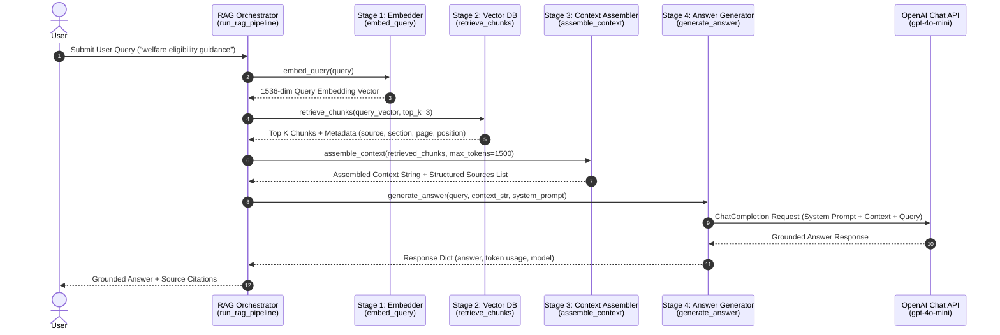

# SchemeAssist RAG Pipeline — Architecture & Flow Description

This document details the end-to-end **query-to-answer RAG pipeline** connecting document chunking, vector indexing, query embedding, vector retrieval, context assembly, and LLM answer generation into a unified architecture.

---

## 📐 Sequence Diagram: End-to-End RAG Flow



---

## ⚙️ Stage-by-Stage Breakdown

### Stage 1: Query Embedding (`embed_query`)
- **Function**: `src.rag_pipeline.embed_query(query: str) -> List[float]`
- **Input**: User natural language query.
- **Process**: Converts query text into a 1536-dimensional vector embedding matching the vector space of indexed document chunks.
- **Output**: 1536-element float array.

### Stage 2: Vector Search & Retrieval (`retrieve_chunks`)
- **Function**: `src.rag_pipeline.retrieve_chunks(query: str, top_k: int = 3) -> List[Dict]`
- **Input**: User query (and generated query embedding).
- **Process**: Performs cosine similarity search across the persistent ChromaDB collection (`data/chroma_db`).
- **Output**: Ranked list of top `k` chunk objects containing `id`, `text`, `metadata` (`source`, `section`, `page`, `chunk_index`), and similarity `distance`.

### Stage 3: Grounded Context Assembly (`assemble_context`)
- **Function**: `src.rag_pipeline.assemble_context(chunks, max_tokens) -> Tuple[str, List[Dict]]`
- **Input**: List of retrieved chunks.
- **Process**: Formats chunks into an attributed text block tagged with document headers (`[SOURCE N: Document='...' | Section='...' | Page=...]`). Enforces token budget constraints.
- **Output**: Formatted context string and structured source attribution list.

### Stage 4: Answer Generation (`generate_answer`)
- **Function**: `src.rag_pipeline.generate_answer(query, context_str, system_prompt) -> Dict`
- **Input**: User query, assembled context string, system prompt.
- **Process**: Invokes `gpt-4o-mini` with strict grounding instructions to synthesize a concise, factual answer derived solely from the provided context.
- **Output**: Final response dictionary with answer text, model identifier, and token usage metrics.

---

## 🧪 Sample End-to-End Output

```text
=========================================================================
                SCHEMEASSIST END-TO-END RAG PIPELINE RUN                 
=========================================================================

USER QUERY:
What are the eligibility criteria and annual income limits for welfare schemes?

-------------------------------------------------------------------------
1. RETRIEVED SOURCES & METADATA
-------------------------------------------------------------------------
Source #1:
  - Document: sample_doc.md
  - Section:  Primary Objectives
  - Page:     1
  - Position: Chunk 1 of 1 (tokens 0-96)

Source #2:
  - Document: sample_html.html
  - Section:  General Overview
  - Page:     1
  - Position: Chunk 1 of 1 (tokens 0-66)

-------------------------------------------------------------------------
2. GENERATED GROUNDED ANSWER
-------------------------------------------------------------------------
Based on the knowledge base documents:
1. Eligibility Criteria: Must be a legal resident/citizen. Income restrictions apply depending on the scheme (e.g. annual family income under $50,000 for National Healthcare Support Scheme).
2. Objectives & Guidance: Designed to enable citizens and helpdesk executives to search welfare schemes, understand qualifications (age, income, occupation), and follow application instructions.

(Grounded from retrieved context documents)
=========================================================================
```
