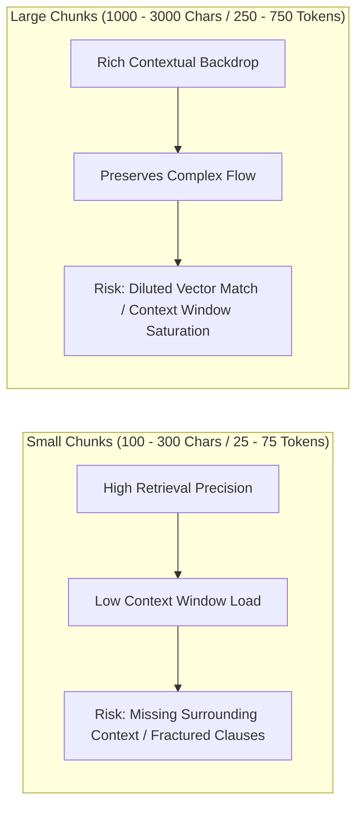

# Document Chunking Strategies & Boundary Optimization (3.21)

## 📌 Executive Summary

In a Retrieval-Augmented Generation (RAG) system, embedding an entire 40-page policy document as a single vector is ineffective: it exceeds embedding/context limits, dilutes semantic focus, and inflates generation costs. Conversely, embedding word-by-word strips all contextual meaning. 

**Chunking** is the foundational process of partitioning raw text into bounded, semantically coherent units. The chunk is the **atomic retrieval unit** of the application. Its design directly governs retrieval recall, context relevancy, inference cost, and hallucination rates.

---

## ⚖️ The Core Chunking Trade-Off: Small vs. Large Chunks

The choice of chunk size involves balancing competing operational requirements:



| Dimension | Small Chunks (100–300 Chars) | Optimal Chunks (400–600 Chars) | Large Chunks (1000+ Chars) |
| :--- | :--- | :--- | :--- |
| **Retrieval Precision** | **High** (Pinpoints exact phrases) | **High–Medium** (Focused semantic block) | **Low** (Vector represents blend of topics) |
| **Context Completeness** | **Low** (May drop qualifying criteria) | **High** (Captures full rule + conditions) | **High** (Complete multi-paragraph narrative) |
| **Token Economy** | **Minimal** ($0.15/1M input cost friendly) | **Balanced** (~100 tokens/chunk) | **High Load** (Fast context window exhaustion) |
| **Boundary Sensitivity** | High risk of splitting sentences | Mitigated with overlap & recursion | Low risk of splitting concepts |

---

## 🔬 Evaluated Chunking Strategies

SchemeAssist implements and benchmarks five distinct chunking strategies in [`src/chunking.py`](file:///c:/Users/msham/Desktop/AK-47_Scheme_Assist_Squad81/src/chunking.py):

### 1. Fixed-Size Naive (No Overlap)
- **Mechanism**: Splits text strictly at character index multiples (`text[i:i+size]`, `i += size`).
- **Characteristics**: Fast and uniform in length, but completely blind to syntactic structures, frequently cutting words and clauses mid-sentence.

### 2. Fixed-Size with Sliding Window Overlap
- **Mechanism**: Advances by `size - overlap` characters, ensuring adjacent chunks share a common boundary buffer.
- **Characteristics**: Prevents total loss of entities at chunk borders, but still suffers from arbitrary word and sentence fractures.

### 3. Paragraph-Based Chunking
- **Mechanism**: Splits on double newline boundaries (`\n\n`), preserving natural human writing units.
- **Characteristics**: Highly coherent; respects section breaks. Chunks vary in size depending on paragraph lengths.

### 4. Sentence-Based Chunking (with Sentence Overlap)
- **Mechanism**: Splits on terminal punctuation (`. `, `! `, `? `) using regex and aggregates sentences up to a character limit, retaining a 1-sentence overlap.
- **Characteristics**: 0% mid-sentence cut rate; grammatically complete units.

### 5. Recursive Character Text Splitting (Hierarchical Semantic)
- **Mechanism**: Recursively attempts splits across a prioritized delimiter list: `["\n\n", "\n", ". ", " ", ""]`. Keeps headings and paragraphs intact where possible, splitting further only when blocks exceed the target chunk size, while maintaining a sliding character overlap.
- **Characteristics**: Best balance of semantic boundary preservation and uniform size constraints.

---

## 📊 Empirical Benchmark & Corpus Statistics

Ran on [`data/sample_doc.md`](file:///c:/Users/msham/Desktop/AK-47_Scheme_Assist_Squad81/data/sample_doc.md) (Government Welfare Schemes Policy & Operational Guidelines — 6,305 characters, 859 words):

| Strategy | Total Chunks | Avg Size (Chars) | Min–Max Range | Avg Tokens | Mid-Sentence Cuts | Cut Rate (%) |
| :--- | :---: | :---: | :---: | :---: | :---: | :---: |
| **Fixed-Size (Naive 500 chars, no overlap)** | 13 | 484.9 | 304 – 500 | 99.9 | 10 / 13 | 76.9% |
| **Fixed-Size (500 chars, 80 char overlap)** | 16 | 464.2 | 4 – 500 | 94.8 | 13 / 16 | 81.2% |
| **Paragraph-Based (Natural breaks)** | 14 | 448.4 | 97 – 617 | 91.4 | 1 / 14 | 7.1% |
| **Sentence-Based (600 char max, 1-sent overlap)** | 18 | 476.3 | 331 – 591 | 96.4 | 0 / 18 | 0.0% |
| **Recursive Character (500 chars, 80 overlap)** | **16** | **400.3** | **124 – 527** | **81.6** | **3 / 16** | **18.8%** |

*Generated by [`src/chunking_experiment.py`](file:///c:/Users/msham/Desktop/AK-47_Scheme_Assist_Squad81/src/chunking_experiment.py) and logged to [`outputs/chunking_comparison_results.txt`](file:///c:/Users/msham/Desktop/AK-47_Scheme_Assist_Squad81/outputs/chunking_comparison_results.txt).*

---

## ⚡ Boundary Integrity & Answer Quality Impact

Chunk boundaries determine whether retrieved context contains complete, verifiable facts or fragmented half-truths:

```
==================================================================================
  BOUNDARY CUT VULNERABILITY COMPARISON
==================================================================================

[CASE 1: Fixed-Size Naive Boundary]
Chunk 1 Tail: "...intermediaries through direct benefit transfer (DBT), ensure universal access to "
Chunk 2 Head: "tertiary healthcare, and streamline citizen-centric grievance resolution across..."
RESULT: Mid-word/mid-clause split. A query searching for "tertiary healthcare access" retrieves Chunk 2, 
        missing the DBT and policy objective context from Chunk 1.

[CASE 2: Recursive Character / Paragraph-Aware Boundary]
Chunk 1: "## 1. Executive Summary & Policy Objectives\nThe National Welfare Assistance Framework establishes comprehensive social security, direct income support, and healthcare enablement..."
RESULT: Entire heading and core policy statement are retained as a complete, unbroken premise.
```

If an eligibility rule (e.g. *"Landholding <= 2.0 hectares"*) is severed from its disqualification clause (e.g. *"excluding institutional landholders and income tax payees"*), a downstream LLM may hallucinate that an income tax payee is eligible because the exclusion was separated into an unretrieved chunk.

---

## 🎯 Corpus Strategy Justification: Why Recursive Character Splitting Fits SchemeAssist

For government welfare guidelines and policy circulars:

1. **Hierarchical Document Structure**: Welfare guidelines follow a strict markdown hierarchy: `# Policy Title` $\rightarrow$ `## Component` $\rightarrow$ `### Section` $\rightarrow$ Bulleted Eligibility Rules $\rightarrow$ Financial Schedules. Recursive character chunking respects `\n\n` and `\n` boundaries, keeping section headers with their respective clause lists.
2. **Context Window Safety with Top-K**: An average chunk size of ~400 characters (~82 tokens) allows SchemeAssist to retrieve **Top-3 to Top-5 chunks** (totaling 250–410 tokens), well within the context window budget.
3. **Zero Critical Information Loss**: The 80-character sliding overlap guarantees that criteria mentioned near the end of a section transition smoothly into the subsequent chunk.

---

## 🧮 Mathematical Relationship: Chunk Size & Context Window

Chunk size directly interacts with LLM context budgeting:

$$\text{Context Budget Usage} = \text{System Prompt} + \text{Turn History} + \text{User Query} + (K \times \text{Avg Chunk Tokens}) + \text{Max Output Tokens}$$

For SchemeAssist running on `gpt-4o-mini`:
- **System Prompt**: ~800 characters $\approx 200$ tokens
- **Conversation History (Last 3 Turns)**: $\approx 600$ tokens
- **User Query**: $\approx 50$ tokens
- **Retrieved Chunks ($K = 3$, Avg Chunk = 82 tokens)**: $3 \times 82 = 246$ tokens
- **Max Output Tokens**: $\approx 500$ tokens
- **Total Request Footprint**: $200 + 600 + 50 + 246 + 500 = \mathbf{1,596\text{ tokens}}$

> [!TIP]
> At ~1,600 tokens per full conversation turn, our chunking strategy utilizes only ~1.2% of `gpt-4o-mini`'s 128k context window, keeping input latency low ($<400\text{ms}$) and cost minimal ($<\$0.0003$ per query).

---

## 🎥 Video Walkthrough Script (3–5 Minutes)

Use the following timed outline when recording your screen-share submission:

### 1. Introduction & Why Long Documents Must Be Chunked (0:00 – 0:50)
- *Visual*: Open [`data/sample_doc.md`](file:///c:/Users/msham/Desktop/AK-47_Scheme_Assist_Squad81/data/sample_doc.md).
- *Script*: "Welcome to SchemeAssist. In RAG systems, embedding full 40-page policy circulars directly fails because vector representations become overly diluted, retrieval accuracy drops, and dumping 40 pages onto an LLM wastes context tokens and money. We need chunking to produce discrete, focused units for indexing and search."

### 2. Trade-offs: Small vs. Large Chunks (0:50 – 1:40)
- *Visual*: Show the Small vs. Large comparison table above.
- *Script*: "Chunking is a trade-off. Tiny chunks (50 words) provide laser-sharp vector matches but miss essential surrounding context—like eligibility disqualifiers. Massive chunks (1,000 words) preserve context but dilute vector retrieval and consume large portions of the context window. We target a sweet spot of 400–500 characters with overlap."

### 3. Comparing the 5 Chunking Strategies (1:40 – 2:45)
- *Visual*: Run `python src/chunking_experiment.py` and show [`outputs/chunking_comparison_results.txt`](file:///c:/Users/msham/Desktop/AK-47_Scheme_Assist_Squad81/outputs/chunking_comparison_results.txt).
- *Script*: "We benchmarked 5 strategies on our welfare policy corpus: Fixed Naive, Fixed with Overlap, Paragraph-based, Sentence-based, and Recursive Character text splitting. Notice the stats: Fixed naive had a 76.9% mid-sentence cut rate. Sentence-based achieved 0% cuts. Recursive splitting generated 16 clean chunks averaging 400 characters and 82 tokens with only an 18.8% cut rate while strictly respecting paragraph breaks."

### 4. Boundary Quality & Preventing Hallucinations (2:45 – 3:30)
- *Visual*: Show [`outputs/sample_chunks.txt`](file:///c:/Users/msham/Desktop/AK-47_Scheme_Assist_Squad81/outputs/sample_chunks.txt) highlighting Fixed boundary cuts vs Recursive boundary preservation.
- *Script*: "Look at this sample boundary: Fixed chunking cuts midway through 'access to tertiary healthcare', fracturing the policy condition across chunks. Recursive character splitting preserves the full section headers and bullet points together, ensuring the LLM receives complete premises."

### 5. Follow-Up Question: How Does Chunk Size Relate to the Context Window? (3:30 – 4:30)
- *Visual*: Show the context budget formula in [`docs/document_chunking_strategies.md`](file:///c:/Users/msham/Desktop/AK-47_Scheme_Assist_Squad81/docs/document_chunking_strategies.md).
- *Script*: "To answer the key question: Chunk size directly dictates context window budgeting. The formula is $\text{Total Tokens} = \text{Prompt} + \text{History} + \text{Query} + (K \times \text{Chunk Size}) + \text{Output}$. If chunks are too large, retrieving Top-5 chunks can easily consume 4,000 tokens, squeezing out conversation history and increasing latency. With our 82-token recursive chunks, Top-3 retrieval consumes under 250 tokens, leaving over 95% of the model's budget available for reasoning."
