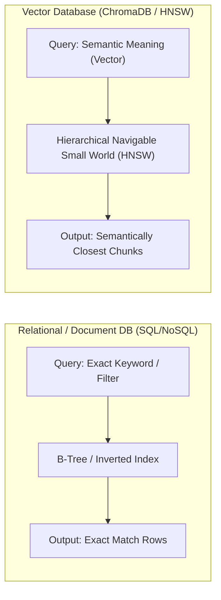

# 3.30 Vector Database Setup & Collection Design

## 📌 Executive Summary

Embeddings require a specialized persistence layer capable of sub-millisecond approximate nearest-neighbor (ANN) search. Traditional relational databases (RDBMS) or document stores excel at exact keyword lookups, $B$-tree range scans, and relational joins, but cannot efficiently compute geometric proximity (such as cosine distance) across high-dimensional vector spaces.

In this milestone, **SchemeAssist** integrates **ChromaDB** as its vector database engine. We configure a persistent collection with exact dimensional alignment (1536 dimensions matching `text-embedding-3-small`), enforce a unified record schema (ID + Vector + Document Text + Metadata), and verify end-to-end record insertion and exact readback.

---

## ⚖️ Vector Databases vs. Traditional Databases



| Dimension | Relational Database (PostgreSQL / MySQL) | Vector Database (ChromaDB / Qdrant / Pinecone) |
| :--- | :--- | :--- |
| **Primary Query Type** | Exact match (`WHERE id = '...'`, `WHERE age > 60`) | Nearest-neighbor similarity (`cosine`, `l2`, `ip`) |
| **Indexing Structure** | $B$-Trees, Hash Indexes, Inverted Indexes | HNSW (Hierarchical Navigable Small World), IVF |
| **Vocabulary Flexibility** | Rigid: Query wording must match stored tokens exactly | Semantic: Synonyms and paraphrased concepts match closely |
| **Data Representation** | Scalar values (integers, strings, timestamps) | Dense floating-point vectors ($D = 1536$) + metadata |
| **Retrieval Output** | Boolean match set | Ranked list ordered by distance / similarity score |

---

## 📐 Collection Design & Dimensional Alignment

### Why Dimensional Alignment is Critical
The vector collection dimensionality **must strictly equal** the embedding model's output dimension:
- In SchemeAssist, the embedding model is `text-embedding-3-small`, which outputs vectors of length **1536**.
- If a collection were configured for 768 dimensions and receives a 1536-dimensional vector, the database cannot perform dot products or calculate distances because the vector spaces are incompatible.
- **Fail-Early Validation**: In [`src/vector_store.py`](../src/vector_store.py), `validate_vector_dimension()` intercepts any vector length mismatch prior to insertion, raising an explicit `ValueError`.

### Collection Configuration
- **Collection Name**: `schemeassist_chunks`
- **Embedding Dimensionality**: `1536`
- **Distance Metric**: `cosine` (`hnsw:space = "cosine"`)
- **Persistence Directory**: `chroma_db/`

$$\text{Cosine Distance} = 1 - \frac{u \cdot v}{\|u\|_2 \|v\|_2}$$
$$\text{Similarity Score} = 1 - \text{Distance}$$

---

## 📝 Stored Record Schema Design

A vector alone is simply an anonymous array of 1536 floating-point numbers. It cannot answer a user's question. To enable grounded Retrieval-Augmented Generation (RAG), the database must store the vector alongside its original text and rich provenance metadata:

```json
{
  "id": "pmkisan_scheme_doc.md:chunk_0",
  "vector": [0.0124, -0.0431, "...", 0.0891],
  "text": "Pradhan Mantri Kisan Samman Nidhi (PM-KISAN) provides income support of Rs 6,000 per year...",
  "metadata": {
    "source": "pmkisan_scheme_doc.md",
    "chunk_index": 0,
    "section": "1. Scheme Overview & Direct Benefit Transfer",
    "page": 1,
    "token_count": 48,
    "category": "agriculture_income_support"
  }
}
```

### Why Text and Metadata Belong with the Vector:
1. **Grounded Answer Synthesis**: The LLM synthesizes answers from human-readable text, not vector coordinates. Storing `text` eliminates secondary lookups against a separate file store.
2. **Citation & Auditability**: The `source`, `section`, and `page` metadata allow SchemeAssist to cite exact government circulars and section numbers in generated responses.
3. **Hybrid Filtering**: Enables pre-filtering or post-filtering queries by category, scheme name, or eligibility demographic before computing nearest neighbors.

---

## 🔬 Readback Verification Proof

Ran via [`src/verify_vector_store.py`](../src/verify_vector_store.py):

```text
================================================================================
  SCHEMEASSIST: 3.30 VECTOR DATABASE SETUP & COLLECTION DESIGN VERIFICATION
================================================================================

[TASK 1] Connecting to vector database...
  • DB Type      : chroma
  • Persist Dir  : chroma_db (in_memory=False)
  [OK] Connection established successfully to ChromaDB.

[TASK 2] Configuring collection...
  • Collection Name   : schemeassist_chunks
  • Vector Dimension  : 1536 (matches text-embedding-3-small)
  • Similarity Metric : cosine (HNSW space: cosine)
  [OK] Collection 'schemeassist_chunks' initialized with dimension 1536.

[TASK 3] Constructing test record with unified RAG schema...
  • Schema Fields : id, vector, text, metadata
  • Target ID     : pmkisan_scheme_doc.md:chunk_0
  • Vector Dim    : 1536 floats
  • Metadata Keys : ['source', 'chunk_index', 'section', 'page', 'token_count', 'category']

[TASK 4] Upserting record and reading back from vector database...
  [OK] Record 'pmkisan_scheme_doc.md:chunk_0' successfully upserted.

--- READBACK VERIFICATION ---
  readback id   : pmkisan_scheme_doc.md:chunk_0
  vector length : 1536
  text preview  : Pradhan Mantri Kisan Samman Nidhi (PM-KISAN) provides income support of Rs 6,000...
  metadata      : {'section': '1. Scheme Overview & Direct Benefit Transfer', 'source': 'pmkisan_scheme_doc.md', 'token_count': 48, 'page': 1, 'category': 'agriculture_income_support', 'chunk_index': 0}

--- SCHEMA INTEGRITY CHECKS ---
  • ID Match               : [PASSED]
  • Vector Length Match    : [PASSED]
  • Text Integrity Match   : [PASSED]
  • Metadata Fields Match  : [PASSED]

[RETRIEVAL TEST] Running semantic similarity query...
  • Query        : "How much money do farmers receive in installments under PM-KISAN?"
  • Top Match ID : pmkisan_scheme_doc.md:chunk_0
  • Score (Cos)  : 0.1404
  • Distance     : 0.8596
  • Source File  : pmkisan_scheme_doc.md
  [OK] Nearest-neighbor search operational and verified.

[SAFETY TEST] Validating dimension mismatch rejection...
  [OK] Successfully rejected invalid vector dimension (768 vs 1536)

[ARTIFACTS PERSISTED]
  • JSON Audit Report : outputs/vector_db_readback_results.json
  • Text Audit Report : outputs/vector_db_readback_results.txt
================================================================================
```

---

## 🌐 Choosing a Production Vector Database

When evaluating vector databases for production workloads, balance six core architectural criteria:

| Evaluation Criterion | Low-Scale / Embedded (ChromaDB, SQLite-VSS) | Mid-Scale / Self-Hosted (Qdrant, Weaviate, pgvector) | Large-Scale / Managed SaaS (Pinecone, Milvus) |
| :--- | :--- | :--- | :--- |
| **Corpus Scale** | Up to ~100k vectors | 100k to 10M vectors | Billions of vectors |
| **Operational Overhead** | Zero (Embedded inside Python process) | Moderate (Docker container / Kubernetes cluster) | Zero (Fully managed cloud SaaS) |
| **Metadata Filtering** | Good for in-memory / local SQLite | Excellent (payload indexes & pre-filtering) | High-performance distributed filtering |
| **Cost Profile** | Free / Open Source | Infrastructure compute & storage only | Consumption-based pricing ($/index/hour) |
| **Data Sovereignty** | Local file system (air-gapped capable) | On-premise VPC deployment | Cloud provider data centers |

**Production Decision for SchemeAssist**:
- For local development, CI/CD, and edge deployment: **ChromaDB** is ideal due to its Python native embedding, zero daemon requirements, and local persistence.
- For high-concurrency public citizen services (>10,000 queries/min): Migrate seamlessly to **Qdrant** or **pgvector** using the unified `VectorStore` adapter interface.

---

## 🚀 Commands & Artifacts

1. **Run Verification & Readback**:
   ```bash
   python src/verify_vector_store.py
   ```
2. **Run Dedicated Unit Tests**:
   ```bash
   python -m unittest tests/test_vector_store.py -v
   ```
3. **Run Full Test Suite**:
   ```bash
   python -m unittest discover tests -v
   ```

### Persisted Artifacts:
- **JSON Audit Report**: [`outputs/vector_db_readback_results.json`](../outputs/vector_db_readback_results.json)
- **Text Audit Report**: [`outputs/vector_db_readback_results.txt`](../outputs/vector_db_readback_results.txt)
