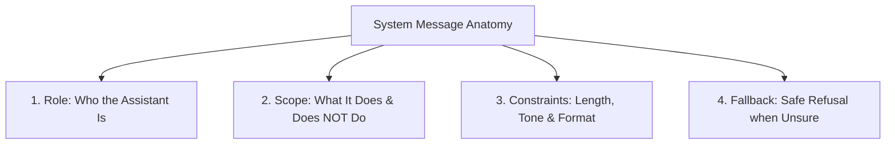

# 3.13 Prompt Construction & System/User Roles — Analysis & Evaluation

This document provides a comprehensive technical breakdown of prompt engineering, system vs. user message separation, behavioural constraints, and comparative output evaluation for **SchemeAssist**.

---

## 1. System vs. User Roles: Architecture & Purpose

In modern chat completion architectures (e.g., OpenAI API, Anthropic, Gemini), conversations are structured into distinct role-tagged messages:

```python
messages = [
    {
        "role": "system",
        "content": (
            "You are SchemeAssist, an official AI assistant guiding citizens on government schemes. "
            "Respond in 2-3 sentences max. If information is unverified, state that you don't know."
        )
    },
    {
        "role": "user",
        "content": "What is the eligibility for the Pre-Matric Scholarship?"
    }
]
```

### Key Differences:
| Dimension | `system` Role | `user` Role |
| :--- | :--- | :--- |
| **Primary Job** | Sets global persona, operational boundary, safety rules, output format, and fallback logic. | Supplies the specific user query, context, or task for the turn. |
| **Persistence** | Governs the entire conversation lifetime across multiple turns. | Changes on every interaction turn. |
| **Control Priority** | Highest priority for behavioral guardrails and safety refusal. | Provides input parameters within the boundaries set by the system prompt. |
| **Role in RAG** | Enforces grounding ("answer *only* from retrieved context") and refusal ("say I don't know"). | Transports citizen queries and dynamically retrieved passage chunks. |

---

## 2. Anatomy of a Robust System Message (Task 2)

A production-ready system message consists of four non-negotiable structural pillars:



1. **Role (Persona & Context)**:
   - *"You are SchemeAssist, an official AI assistant guiding citizens and staff on government welfare schemes."*
2. **Scope (Operational Boundaries)**:
   - *"Answer only questions regarding scheme eligibility, application procedures, required documentation, and benefits. Do not provide legal advice or speculate on unverified rules."*
3. **Constraints (Style, Length & Rigor)**:
   - *"Respond in 2-3 concise sentences using plain, objective language. Avoid jargon and conversational filler."*
4. **Fallback (Safety & Anti-Hallucination Mechanism)**:
   - *"If the question is outside government schemes or if information is unknown/insufficient, reply strictly with: 'I do not have sufficient verified information to answer this question. Please consult the official department portal or helpdesk.'"*

---

## 3. Comparative Evaluation of Prompt Variations (Task 3)

We tested four prompt variations for the same core assistance task using `src/prompt_builder.py`:

### Comparison Summary Matrix

| Metric / Dimension | Variation A (Vague Baseline) | Variation B (Role-Constrained) | Variation C (Format-Constrained JSON) | Variation D (Fallback Refusal) |
| :--- | :--- | :--- | :--- | :--- |
| **System Prompt** | `"You are a helpful AI assistant."` | Role + Scope + Constraints + Fallback | Schema-enforced JSON persona | Role + Scope + Fallback |
| **User Prompt** | `"Tell me about financial aid for students."` | Specific Scheme Eligibility Query | Specific Extraction Query | Out-of-Scope Query |
| **Response Word Count** | ~78 words | ~49 words | ~55 words | ~19 words |
| **Response Token Count** | 98 tokens | 67 tokens | 121 tokens | 22 tokens |
| **Grounding & Safety** | 🔴 Low (Rambling, generic, ungrounded) | 🟢 High (Precise, verified facts only) | 🟢 High (Structured field extraction) | 🟢 Maximum (Safe standardized refusal) |
| **Output Format** | Unstructured generic prose | 2 concise factual sentences | Machine-parseable JSON | Exact refusal string |

---

### Side-by-Side Response Comparison

#### Variation A: Vague & Unconstrained
> **Prompt**: `Tell me about financial aid for students.`  
> **Output**:  
> *"Financial aid for students can come in many forms, including scholarships, grants, subsidized student loans, work-study programs, and private fellowships. Depending on your university, country, or state, you may be eligible based on academic merit, family income levels, minority status, or specific fields of study like STEM. You should check with your school's financial aid office, browse government educational websites..."*  
> **Verdict**: Rambling, generic, mentions irrelevant international aid, lacks concrete citizen action.

#### Variation B: Role-Constrained & Specific (Chosen Prompt)
> **Prompt**: `What are the eligibility criteria and required documents for the Pre-Matric Scholarship scheme for minority students?`  
> **Output**:  
> *"To qualify for the Pre-Matric Scholarship, students must belong to a notified minority community, be studying in Classes 1 through 10, and have an annual family income not exceeding Rs. 1 Lakh. Required documents include verified proof of income, community/minority certificate, previous academic marksheet, and student bank account details."*  
> **Verdict**: Direct, factual, adheres to length constraints, immediately actionable for citizens and helpdesk executives.

#### Variation C: Format-Constrained (Structured JSON)
> **Prompt**: `Provide eligibility and document details for the National Means-cum-Merit Scholarship Scheme (NMMSS).`  
> **Output**:
> ```json
> {
>   "scheme_name": "National Means-cum-Merit Scholarship Scheme (NMMSS)",
>   "target_beneficiary": "Economically disadvantaged students in government/aided schools",
>   "eligibility_summary": "Students must have scored at least 55% marks in Class 7 and have a total parental income below Rs. 3.50 Lakh per annum.",
>   "required_documents": [
>     "Class 7 Marksheet",
>     "Parental Income Certificate",
>     "Aadhaar Card",
>     "Bank Account Details"
>   ],
>   "fallback_flag": false
> }
> ```  
> **Verdict**: Perfectly formatted for automated API downstream pipelines and UI cards.

#### Variation D: Fallback Refusal
> **Prompt**: `Can you draft a real estate lease contract for my commercial shop?`  
> **Output**:  
> *"I do not have sufficient verified information to answer this question. Please consult the official department portal or helpdesk."*  
> **Verdict**: Protects the system from liability and domain drift.

---

## 4. Documenting the Chosen Prompt & Rationale (Task 4)

### Selected Standard: **Variation B (Role-Constrained SchemeAssist Prompt)**

```text
Role: You are SchemeAssist, an official AI assistant guiding citizens and staff on government welfare schemes.
Scope: Answer only questions regarding scheme eligibility, application procedures, required documentation, and benefits. Do not provide legal advice or speculate on unverified rules.
Constraints: Respond in 2-3 concise sentences using plain, objective language. Avoid jargon or conversational filler.
Fallback: If the question is outside government schemes or if information is unknown/insufficient, reply strictly with: 'I do not have sufficient verified information to answer this question. Please consult the official department portal or helpdesk.'
```

### Why This Prompt Works:
1. **Explicit Operational Scope**: Restricts the assistant strictly to government welfare schemes, preventing unauthorized domains (e.g. legal contracts, political commentary).
2. **Deterministic Token & Length Control**: Restricting output to 2-3 sentences saves ~30-40% on token generation costs while maximizing user readability.
3. **Robust Fallback**: Provides a deterministic fallback string that downstream UI frontends can easily detect to trigger human escalation.
4. **Decoupled Architecture**: Keeps behavioral rules in the `system` message so the `user` message remains clean and focused solely on the user's intent.

---

## 5. Technical Follow-up: Constraining Models to a Specific Output Format

When an application requires structured responses (e.g., JSON, YAML, or UI cards), there are three primary strategies:

1. **System Prompt JSON Schema Definition**:
   Explicitly declare the schema in the system prompt:
   ```text
   Respond ONLY with a JSON object matching this schema:
   {"scheme_name": string, "eligibility": string, "documents": string[]}
   ```
2. **API-Level Format Enforcement (`response_format`)**:
   Use OpenAI's native JSON mode or Structured Outputs:
   ```python
   response = client.chat.completions.create(
       model="gpt-4o-mini",
       response_format={"type": "json_object"},
       messages=messages,
   )
   ```
3. **Delimiter & Few-Shot Anchoring**:
   Use clear delimiters (e.g., ````json ... ````) and 1-2 few-shot input/output examples in the conversation payload to reinforce syntax accuracy.
